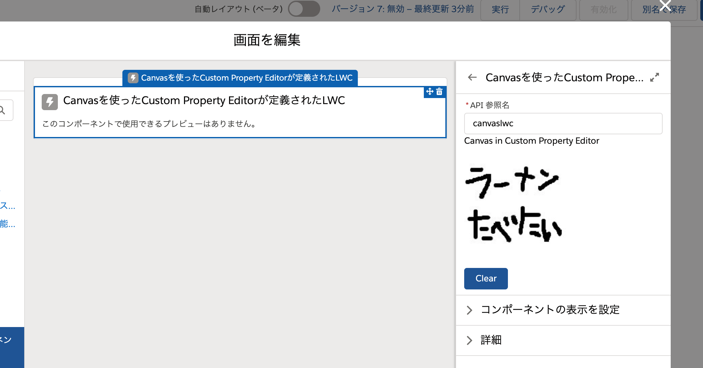
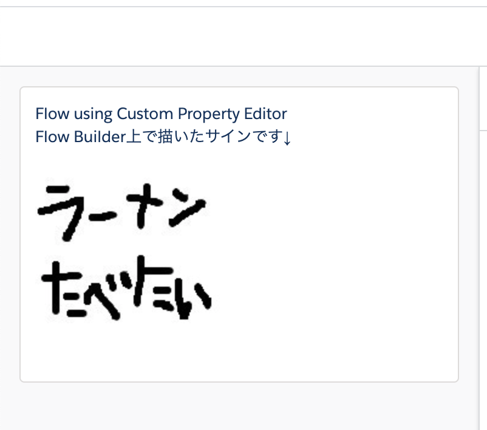

# Try LWC Custom Property Editor

LWC Custom Property Editorを試してみる中で、HTML CanvasをFlow Builderに組み込んでみました。

- [lwc/lwcForFlowWithCustomPropertyEditor](https://github.com/ninoish/lwc-custom-property-editor-html-canvas/tree/master/force-app/main/default/lwc/lwcForFlowWithCustomPropertyEditor)
  - Flow Builderで配置するLWCコンポーネント
- [lwc/customCanvasPropertyEditor](https://github.com/ninoish/lwc-custom-property-editor-html-canvas/tree/master/force-app/main/default/lwc/customCanvasPropertyEditor)
  - 上記コンポーネント内で使われる Custom Property Editor

## Flow Builder

## Flow実行

